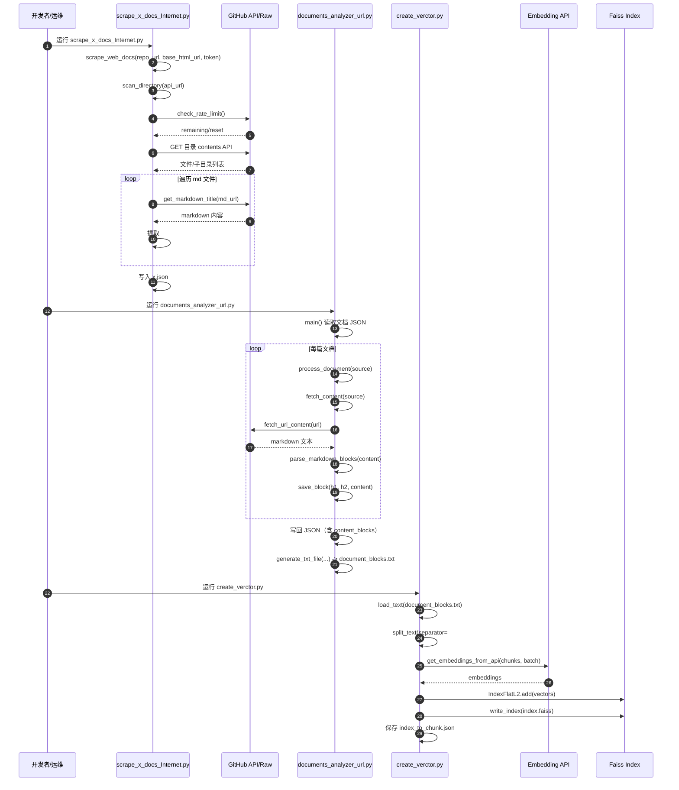
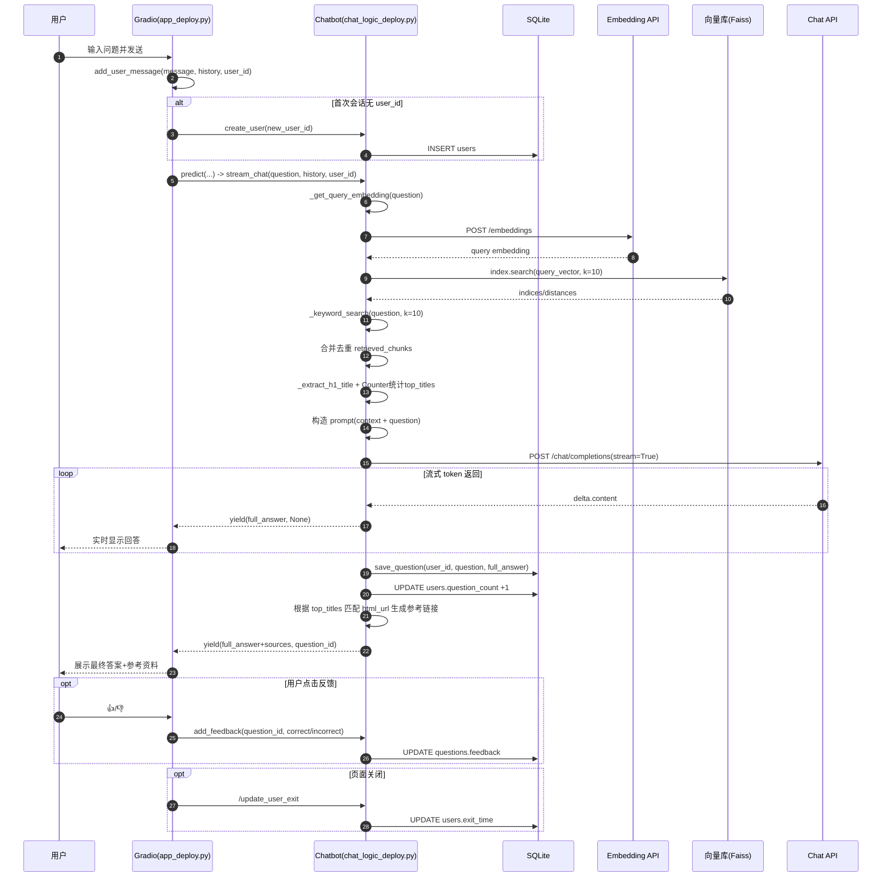

# X-RAG 时序图

## 离线建库时序图（抓取 -> 分块 -> 向量库）

```mermaid
sequenceDiagram
    autonumber
    participant U as 开发者/运维
    participant S as scrape_x_docs_Internet.py
    participant G as GitHub API/Raw
    participant A as documents_analyzer_url.py
    participant C as create_verctor.py
    participant E as Embedding API
    participant F as Faiss Index

    U->>S: 运行 scrape_x_docs_Internet.py
    S->>S: scrape_web_docs(repo_url, base_html_url, token)
    S->>S: scan_directory(api_url)
    S->>G: check_rate_limit()
    G-->>S: remaining/reset
    S->>G: GET 目录 contents API
    G-->>S: 文件/子目录列表
    loop 遍历 md 文件
        S->>G: get_markdown_title(md_url)
        G-->>S: markdown 内容
        S->>S: 提取 # 标题 + 组装 html_url
    end
    S->>S: 写入 x.json

    U->>A: 运行 documents_analyzer_url.py
    A->>A: main() 读取文档 JSON
    loop 每篇文档
        A->>A: process_document(source)
        A->>A: fetch_content(source)
        A->>G: fetch_url_content(url)
        G-->>A: markdown 文本
        A->>A: parse_markdown_blocks(content)
        A->>A: save_block(h1, h2, content)
    end
    A->>A: 写回 JSON（含 content_blocks）
    A->>A: generate_txt_file(...) -> document_blocks.txt

    U->>C: 运行 create_verctor.py
    C->>C: load_text(document_blocks.txt)
    C->>C: split_text(separator=################)
    C->>E: get_embeddings_from_api(chunks, batch)
    E-->>C: embeddings
    C->>F: IndexFlatL2.add(vectors)
    C->>F: write_index(index.faiss)
    C->>C: 保存 index_to_chunk.json
```

## 在线问答时序图（输入 -> 检索 -> 生成 -> 回传）

```mermaid
sequenceDiagram
    autonumber
    participant User as 用户
    participant UI as Gradio(app_deploy.py)
    participant Bot as Chatbot(chat_logic_deploy.py)
    participant DB as SQLite
    participant Emb as Embedding API
    participant Faiss as 向量库(Faiss)
    participant LLM as Chat API

    User->>UI: 输入问题并发送
    UI->>UI: add_user_message(message, history, user_id)
    alt 首次会话无 user_id
        UI->>Bot: create_user(new_user_id)
        Bot->>DB: INSERT users
    end

    UI->>Bot: predict(...) -> stream_chat(question, history, user_id)

    Bot->>Bot: _get_query_embedding(question)
    Bot->>Emb: POST /embeddings
    Emb-->>Bot: query embedding

    Bot->>Faiss: index.search(query_vector, k=10)
    Faiss-->>Bot: indices/distances
    Bot->>Bot: _keyword_search(question, k=10)
    Bot->>Bot: 合并去重 retrieved_chunks
    Bot->>Bot: _extract_h1_title + Counter统计top_titles
    Bot->>Bot: 构造 prompt(context + question)

    Bot->>LLM: POST /chat/completions(stream=True)
    loop 流式 token 返回
        LLM-->>Bot: delta.content
        Bot-->>UI: yield(full_answer, None)
        UI-->>User: 实时显示回答
    end

    Bot->>DB: save_question(user_id, question, full_answer)
    Bot->>DB: UPDATE users.question_count +1
    Bot->>Bot: 根据 top_titles 匹配 html_url 生成参考链接
    Bot-->>UI: yield(full_answer+sources, question_id)
    UI-->>User: 展示最终答案+参考资料

    opt 用户点击反馈
        User->>UI: 👍/👎
        UI->>Bot: add_feedback(question_id, correct/incorrect)
        Bot->>DB: UPDATE questions.feedback
    end

    opt 页面关闭
        UI->>Bot: /update_user_exit
        Bot->>DB: UPDATE users.exit_time
    end
```
